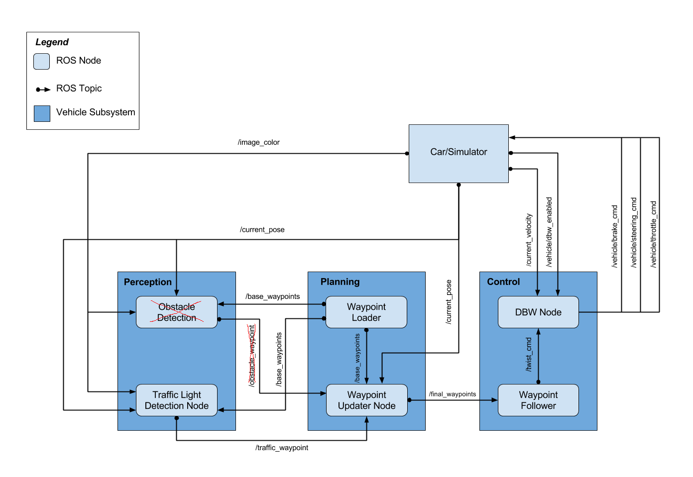

# System Integration Project
In this project the core functionality of the autonomous vehicle system, including traffic light detection, control, and waypoint following is implemented. 

### Documentation
1. [Instructions for setting up development environment](https://github.com/udacity/CarND-Capstone)
2. System architecture  
  

### Implementation details

We have been following the software architecture specified by the course. However we noticed that the `Obstacle Detection` module has been removed and therefore no `/obstacle_waypoint` has been published or subscribed.
I have used the codes present in the the sdcnd and open forum portals.

#### Overview
The starter repo has provided the skeleton of this architecture and all the ROS node has been provided with starter file. There are three ROS nodes in this diagram that we need to work on.

They are:

- Waypoint Updater Node
- DBW Node
- Traffic Light Detection Node
